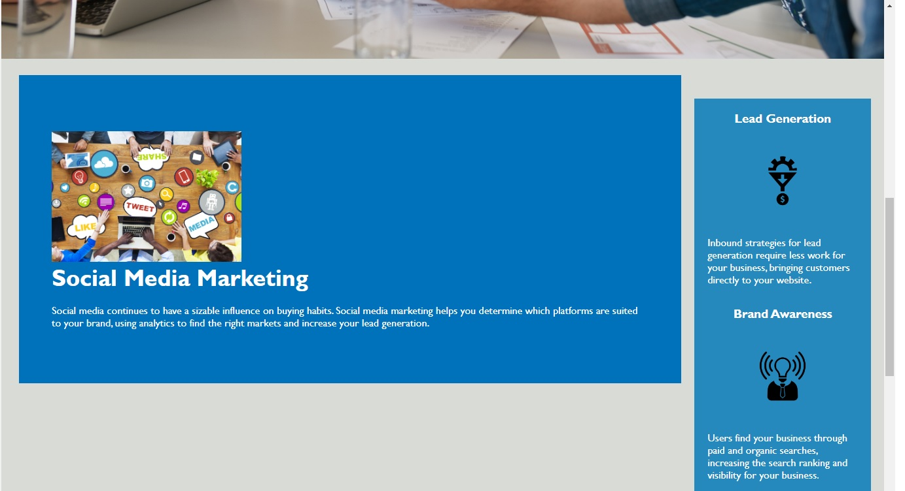

# Horiseon
Week 1 Challenge: Developed Code

The objective of this challenge was to develop a pre-written code so that it was simplified and presented using semantic HTML elements; but also maintained its' functionality.

Current Issues:
Due to an issue with positioning; div containers are stacking on top of each other, rather than in a column along the y-axis.

